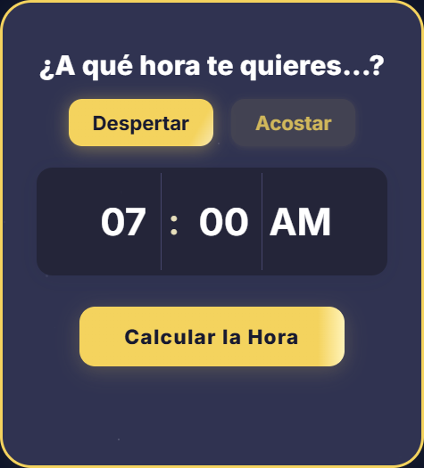

# Calculadora de Sueño

**Calculadora de Sueño** es una herramienta gratuita y fácil de usar que te ayuda a descubrir la mejor hora para dormir o despertarte, basándose en ciclos naturales de sueño de 90 minutos. Optimiza tu descanso, despiértate renovado y mejora tu salud del sueño con solo un clic.

Accede a la calculadora en: [https://calculadoraciclosdesueno.com](https://calculadoraciclosdesueno.com)

---

## Características principales

- 100% gratuita y en español
- Calcula la mejor hora para dormir o despertar
- Basada en ciclos de sueño naturales
- Totalmente responsive (funciona en móvil, tablet y PC)
- Widget fácil de integrar en cualquier sitio web o blog
- Sin necesidad de registro

---

## Vista previa



---

---

## 🚀 Cómo Integrar la Calculadora en tu Sitio Web

Integra fácilmente nuestra calculadora en tu blog o página web copiando el siguiente código embed. Esto permitirá a tus visitantes calcular sus ciclos de sueño directamente desde tu sitio.

### Código Embed:

```html
<div style="max-width:410px; width:100%; background:#0c0c0c; border-radius:28px; margin:0 auto;">
  <div style="position:relative; width:100%; padding-top:136.5%;">
    <iframe
      src="https://calculadoraciclosdesueno.com/widget"
      title="Calculadora de Sueño"
      aria-label="Calculadora de Sueño"
      loading="lazy"
      style="position:absolute; top:0; left:0; width:100%; height:100%; border-radius:28px; background:#0c0c0c;"
      allowfullscreen
    ></iframe>
  </div>
</div>
<p style="text-align:center; font-size:0.98rem; margin-top:0.6em;">
  <span style="color:#454553;">Calculadora por</span>
  <a href="https://calculadoraciclosdesueno.com/" target="_blank" rel="noopener noreferrer"
     style="color:#3578e5; text-decoration:underline; font-weight:500;">
    calculadoraciclosdesueno.com
  </a>
</p>